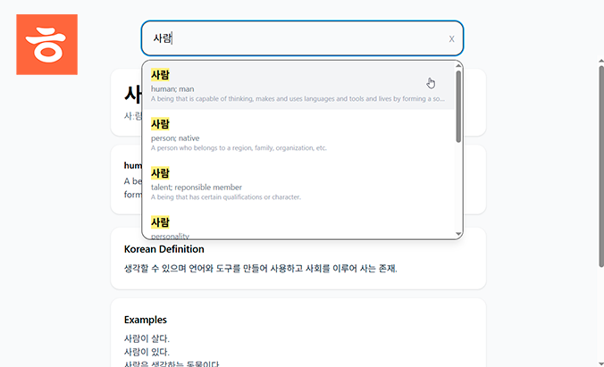

# Offline Korean Dictionary (OKDict)



A desktop dictionary application for Windows, designed for fast Korean ↔ English lookup with ranking-based search.
The database uses the [KRDict](https://krdict.korean.go.kr/) dictionary from the Korean Language Institute.

Downloads are available on the release section.

---

## Features

- 🔍 Fast search for Korean and English words.
- 📊 Relevance-based ranking system.
- 📝 Example sentences.
- 🔊 Audio pronunciation support (\* This feature requires internet connection)
- 📦 Portable and installer builds available.

---

## Tech Stack

- Electron – Desktop runtime
- React – UI layer
- Vite – Frontend bundler
- SQLite (better-sqlite3) – Local database
- Tailwind CSS – Styling
- IPC (Electron) – Main/Renderer communication
- es-hangul – Korean text processing

---

## Getting Started (Development)

### 1. Clone the repository

```bash
git clone https://github.com/your-username/dictionary-app.git
cd dictionary-app
```

### 2. Install dependencies

```bash
npm install
```

### 3. Run the app in development mode

```bash
npm run dev
```

This will:

- Start Vite dev server
- Launch Electron app
- Enable hot reload for UI

---

### Create distributable (installer + portable)

```bash
npm run dist
```

Output will be generated in:

```
dist/
```

Includes:

- .exe installer
- portable .exe

---

## Project Structure

```
dictionary-app/
├── assets/              # Icons and static assets
├── db/                  # SQLite database
├── electron/            # Electron main + preload
│   ├── main.cjs
│   └── preload.cjs
├── src/                 # React frontend
├── dist/                # Vite build output
├── package.json
└── vite.config.ts
```

---

## Database

- Uses a local SQLite database (`db/dict.db`)
- Loaded via better-sqlite3

---

## API

Exposed via preload:

```js
window.api.search(query);
window.api.getWord(id);
```

---

## Search Logic

The search engine ranks results using:

- Exact match.
- Prefix match.
- Substring match.
- Korean consonant (초성) matching.
- English keyword matching.
- Definition matching.

---

## Roadmap

- [ ] Linux version.
- [ ] History and bookmarks.
- [ ] User can select differend dictionaries by replacing the db.
- [ ] Dark mode.
- [ ] Multi-language support.

---

## Contributing

Pull requests are welcome. For major changes, please open an issue first.

---

## License

MIT License
KRDict database under [CC BY-SA 2.0 KR](https://krdict.korean.go.kr/kor/kboardPolicy/copyRightTermsInfo) license

---
